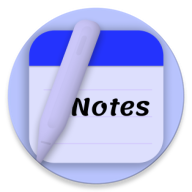

  

# Notes: Simple Notepad ✅

---

## 💥 Personal DevLog (^~^)

<strong>💥 v1.0 (Latest Updates)</strong>

- [x] New homepage redesign
- [x] Navigation drawer added
- [x] Categories and tags added
- [x] Search bar UI revamped
- [x] Backup logics changed
- [x] Note screen simplicity redesign
- [x] Slight animation improvements
- [x] Minor bugs and UI fixes

---

## 👋 Features

**Backup/Restore** • **Custom Layout** • **Markdown** •
**Built-In Calendar**  • **Offline Access** • **Privacy-Friendly** •
**No Bloat Permissions** • **Material You UI** • **Custom Themes** •
**Multiple Export Options** • **Scratchpad** • **Share Text** •
**Flashcard** • **Image Attachments** • **Calculator** • **Fonts** •
**Tags** • **Recycle Bin** • **Screen Protection**

---

## ⚠️ License
    Notes: Simple Notepad

    Copyright (C)2025 gopibhingradiya187
    
    This software is free to use, modify, and redistribute under 
    the terms of the GNU General Public License, as published by the 
    Free Software Foundation. You may choose to use either version 3 of the License 
    or, at your option, any later version. The software is provided with the hope 
    that it will be useful, but it comes as is with no warranties, including 
    implied warranties of MERCHANTABILITY or FITNESS FOR A PARTICULAR PURPOSE. 
    For more details, please refer to the GNU General Public License.

    The above copyright notice, this permission notice, and the license must be included in all copies or substantial portions of the software.

    You can find a copy of the GNU General Public License v3 [here](https://www.gnu.org/licenses/)

